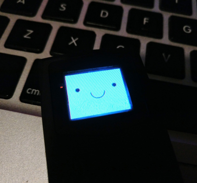

## BMO for the Pocket Sprite

First little thing I've _developed_ for the [Pocket Sprite](https://pocketsprite.com/pages/faq#functionality).

Currently this just renders the face of BMO to the Pocket Sprite display, and also provides the standard power button menu to quit the app.

## How do I use this?

First you need a Pocket Sprite.

Then you could either go through the pain that is setting up the ESP dev environment on your computer, the 8bkc-sdk, and try to build this, or you could just grab the [`omgmog-bmo.app`](build/omgmog-bmo.app) that I've uploaded to this repository, and upload it to your Pocket Sprite (in the [standard way](https://pocketsprite.com/pages/faq#functionality))
